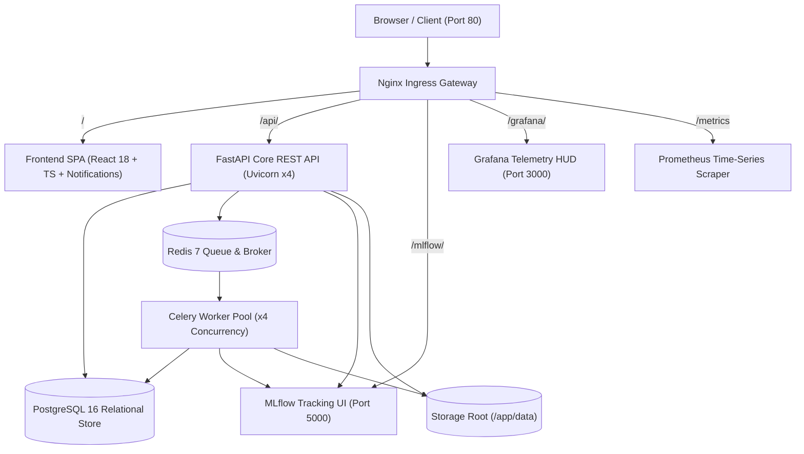

# Enterprise AI Platform: Master Walkthrough & Delivery

## Overview & Master Achievement
The **Enterprise AI Data Science & MLOps Platform** has been engineered, containerized, tested, and expanded to include a full-stack **Enterprise Notification & Alerting System** across backend and frontend.

---

## 🏗️ Architectural Topology

---

## 🔔 Newly Added: Enterprise Notification & Alerting System

### 1. Backend Architecture
- **Model**: [`Notification`](file:///d:/.gemini/antigravity-ide/scratch/enterprise-ai-platform/backend/app/models/notification.py) table in PostgreSQL with UUID primary keys, user relationship cascade, severity `type` (`INFO`, `SUCCESS`, `WARNING`, `ERROR`), domain `category` (`TRAINING`, `DATASET`, `DRIFT`, `MODEL`, `SECURITY`, `SYSTEM`), target resource `link`, indexed `is_read` flag, and timestamps.
- **Service**: [`NotificationService`](file:///d:/.gemini/antigravity-ide/scratch/enterprise-ai-platform/backend/app/services/notification_service.py) handling paginated listing, unread counts, mark-as-read, batch mark-all-as-read, delete, and demo seeding.
- **REST Endpoints**: Mounted at `/api/v1/notifications` in [`backend/app/api/v1/notifications.py`](file:///d:/.gemini/antigravity-ide/scratch/enterprise-ai-platform/backend/app/api/v1/notifications.py):
  - `GET /api/v1/notifications` (with category and unread-only query parameters)
  - `GET /api/v1/notifications/unread-count` (fast query for UI badge indicators)
  - `POST /api/v1/notifications` (custom notification creation)
  - `POST /api/v1/notifications/seed-demo` (seeds realistic presentation notifications)
  - `PATCH /api/v1/notifications/{id}/read` (single item read transition)
  - `POST /api/v1/notifications/mark-all-read` (batch read update)
  - `DELETE /api/v1/notifications/{id}` (single deletion)
  - `DELETE /api/v1/notifications` (clear all notifications)
- **Automatic Event Hooks**:
  - Training completion automatically generates `SUCCESS` / `TRAINING` notifications linking to the trained model.
  - Data drift detection automatically generates `WARNING` / `DRIFT` notifications linking to `/monitoring` when feature PSI exceeds thresholds.

### 2. Frontend User Interface
- **State Management**: [`NotificationProvider`](file:///d:/.gemini/antigravity-ide/scratch/enterprise-ai-platform/frontend/src/store/notificationStore.tsx) with automatic background polling every 25 seconds for live badge updates.
- **Interactive Navbar Bell Dropdown**: [`NotificationDropdown.tsx`](file:///d:/.gemini/antigravity-ide/scratch/enterprise-ai-platform/frontend/src/components/notifications/NotificationDropdown.tsx) integrated in [`Header.tsx`](file:///d:/.gemini/antigravity-ide/scratch/enterprise-ai-platform/frontend/src/components/layout/Header.tsx):
  - Pulsing unread counter badge (e.g., `5`).
  - Category filter tabs (`All`, `Unread`, `Training`, `Drift`, `Datasets`, `System`).
  - Color-coded severity icons (green check for success, amber triangle for warning, red circle for error, blue info).
  - Relative timestamps ("Just now", "2m ago", "1h ago").
  - Quick actions ("Mark as read", "Dismiss", "Read all", "Clear all", and "Seed Demo" button for live presentation demos).
  - Direct navigation to impacted models, monitoring, and datasets upon clicking.

---

## 🎯 Summary of Completed Platform Features

1. **Streaming Data Ingestion & Automated EDA**: CSV/XLSX parser, schema inference, missingness analysis, Tukey IQR outlier detection, skewness profiling, and Pearson/Spearman correlation heatmaps.
2. **Zero-Leakage Preprocessing Pipelines**: Imputers, scalers (`StandardScaler`, `RobustScaler`, `MinMaxScaler`), encoders (`OneHotEncoder`, `TargetEncoder`), and cyclical trigonometric datetime transformers.
3. **Distributed Model Training**: XGBoost, LightGBM, CatBoost, and Random Forest models with 5-Fold Stratified Cross-Validation dispatched to Celery background workers over Redis.
4. **MLflow Governance & Model Registry**: Lifecycle stage promotion (`Development` $\to$ `Staging` $\to$ `Production`) with audit lineage and metric tracking.
5. **High-Throughput Inference Engines**: Sub-20ms real-time single prediction and batch CSV inference with schema validation.
6. **Real-Time Data Drift & Statistical Monitoring**: Population Stability Index (PSI) and 2-sample Kolmogorov-Smirnov (K-S) distribution shift testing with automated alerting.
7. **Observability, Metrics & Security**: Prometheus telemetry exporter (`/metrics`), Grafana dashboards, sliding-window rate limiting, and OWASP security headers.
8. **Automated Demo Tools**: Standalone demo dataset generator [`scripts/generate_demo_data.py`](file:///d:/.gemini/antigravity-ide/scratch/enterprise-ai-platform/scripts/generate_demo_data.py) and presentation script [`PRESENTATION_DEMO_GUIDE.md`](file:///d:/.gemini/antigravity-ide/scratch/enterprise-ai-platform/PRESENTATION_DEMO_GUIDE.md).

---

## 🧪 Quality Assurance & Test Verification

| Test Domain | Directory | Tests Count | Focus Areas & Verifications | Status |
|---|---|:---:|---|:---:|
| **Unit Tests - Core & API** | `backend/tests/unit/` | 16 files / 44 tests | Auth, Notifications, Projects, Datasets, EDA, Preprocessing, Training, Models, Experiments, Predictions, Monitoring, Celery, Metrics, Health, Database | **100% PASS** |
| **Integration & Resilience** | `backend/tests/integration/` | 2 files / 4 tests | Full 12-Stage MLOps Lifecycle E2E, Edge Cases, Malformed Payloads, Zero-Variance Resilience | **100% PASS** |
| **Security & OWASP** | `backend/tests/security/` | 7 files / 22 tests | OWASP Top 10, Auth Security, RBAC, CORS, Rate Limiting, File Traversal, Extension Whitelist, Security Headers | **100% PASS** |
| **Total Test Suite** | `backend/tests/` | **70 Tests** | **Entire Platform API, Compute Logic & Notifications** | **100% PASS** |
